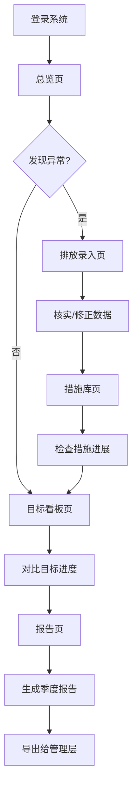

## 1. 产品概述

碳中和管理平台是为园区运营方打造的减排行动跟踪系统，用于监控多栋楼宇的碳排放、管理节能措施、对比目标进度并生成管理报告。
- 解决园区多楼宇碳排放数据分散、减排措施难以追踪、目标进度缺乏可视化的管理痛点
- 目标用户为园区运营管理人员，帮助其实现碳中和目标的精细化管控

## 2. 核心功能

### 2.1 用户角色

| 角色 | 注册方式 | 核心权限 |
|------|----------|----------|
| 园区管理员 | 系统分配 | 全部功能：总览、录入、措施库、目标看板、报告导出 |
| 数据录入员 | 管理员邀请 | 排放数据录入、查看措施库和目标看板 |

### 2.2 功能模块

1. **总览页**：月度排放趋势、能耗结构饼图、目标差距仪表盘、楼宇排名
2. **排放录入页**：电力/水/燃气/车辆里程/外购蒸汽五类数据登记与历史查询
3. **措施库页**：节能项目维护、责任人管理、预算追踪、预计减排量、状态流转
4. **目标看板页**：按楼宇/部门/年份多维度对比目标进度
5. **报告页**：季度摘要生成、异常说明、待办清单、导出功能

### 2.3 页面详情

| 页面名称 | 模块名称 | 功能描述 |
|----------|----------|----------|
| 总览页 | 月度排放趋势图 | 折线图展示近12个月总排放量变化趋势，支持切换楼宇筛选 |
| 总览页 | 能耗结构饼图 | 展示电力/水/燃气/蒸汽/交通五类排放占比 |
| 总览页 | 目标差距仪表盘 | 环形图展示当前排放与年度目标的差距百分比 |
| 总览页 | 楼宇排名卡片 | 按排放量排序展示各楼宇当前月度数据 |
| 排放录入页 | 数据录入表单 | 支持选择楼宇、月份，录入电/水/燃气/车辆里程/蒸汽用量 |
| 排放录入页 | 历史记录表格 | 分页展示已录入数据，支持按楼宇/月份筛选 |
| 排放录入页 | 排放因子换算 | 自动根据排放因子将用量转为 CO₂ 当量 |
| 措施库页 | 项目列表 | 卡片式展示所有节能项目，含状态标签(规划/执行中/已完成/暂停) |
| 措施库页 | 项目详情 | 责任人、预算、预计减排量、实际减排量、起止日期、状态 |
| 措施库页 | 新增/编辑项目 | 表单录入项目信息，支持状态流转 |
| 目标看板页 | 年度目标对比 | 柱状图按楼宇对比年度目标值与实际排放值 |
| 目标看板页 | 部门进度图 | 按部门展示目标完成率进度条 |
| 目标看板页 | 年份趋势对比 | 多年份排放趋势叠加折线图 |
| 报告页 | 季度摘要 | 自动汇总季度排放总量、同比变化、措施进展 |
| 报告页 | 异常说明 | 标记排放超标月份及原因说明 |
| 报告页 | 待办清单 | 列出逾期措施、即将到期项目、数据缺失提醒 |
| 报告页 | 导出功能 | 支持导出 PDF/Excel 格式报告 |

## 3. 核心流程

用户登录后进入总览页查看整体情况，发现某楼宇排放异常后进入排放录入页核实数据，随后在措施库查看相关节能项目进展，再到目标看板确认差距，最后在报告页生成季度报告导出给管理层。

## 4. 用户界面设计

### 4.1 设计风格

- **主色调**：深青绿 (#0D7377) 象征环保与碳中和，辅以暖橙色 (#E8863A) 作为强调色
- **辅助色**：浅灰底 (#F5F7FA)、深灰文字 (#1A2332)、成功绿 (#2ECC71)、警告橙 (#F39C12)、危险红 (#E74C3C)
- **按钮风格**：圆角微凸（border-radius: 8px），主按钮深青绿实心，次按钮白底青绿边框
- **字体**：标题用 Noto Serif SC（衬线体，传递专业感），正文用 Noto Sans SC
- **布局风格**：左侧固定导航栏 + 右侧内容区，卡片式内容模块
- **图标**：线性风格图标（Lucide Icons），保持简洁专业

### 4.2 页面设计概览

| 页面名称 | 模块名称 | UI 元素 |
|----------|----------|---------|
| 总览页 | 月度排放趋势图 | 白色卡片容器，折线图，渐变填充区域，悬停显示数据点 |
| 总览页 | 能耗结构饼图 | 环形图，中心显示总量，右侧图例，色块对应五类排放 |
| 总览页 | 目标差距仪表盘 | 圆弧进度环，中心显示百分比，底部目标值文字 |
| 总览页 | 楼宇排名卡片 | 横向排列卡片，每张含楼宇名、排放量、环比变化箭头 |
| 排放录入页 | 数据录入表单 | 分步表单，选择楼宇→选择月份→录入各类数据→确认提交 |
| 排放录入页 | 历史记录表格 | 条纹表格，表头固定，行悬停高亮，操作列含编辑/删除 |
| 措施库页 | 项目列表 | 卡片网格布局，左上角状态标签，底部进度条 |
| 措施库页 | 项目详情 | 侧边抽屉式详情面板，信息分组展示 |
| 目标看板页 | 年度目标对比 | 分组柱状图，目标柱与实际柱并排对比 |
| 目标看板页 | 部门进度图 | 水平进度条列表，带百分比标注 |
| 报告页 | 季度摘要 | 白色摘要卡片，关键指标大字展示 |
| 报告页 | 导出功能 | 右上角导出按钮，下拉选择格式 |

### 4.3 响应式设计

- 桌面优先设计，最小宽度 1280px 完整展示
- 平板端（768-1279px）导航栏折叠为汉堡菜单，卡片单列排列
- 移动端（<768px）简化图表为数据表格，保留核心录入和查看功能

### 4.4 3D 场景指引

不适用
