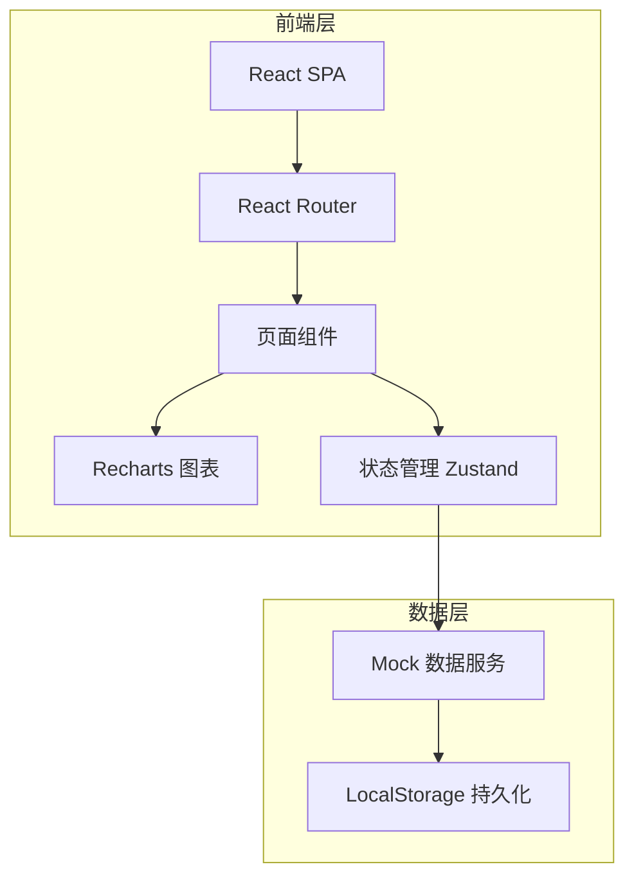
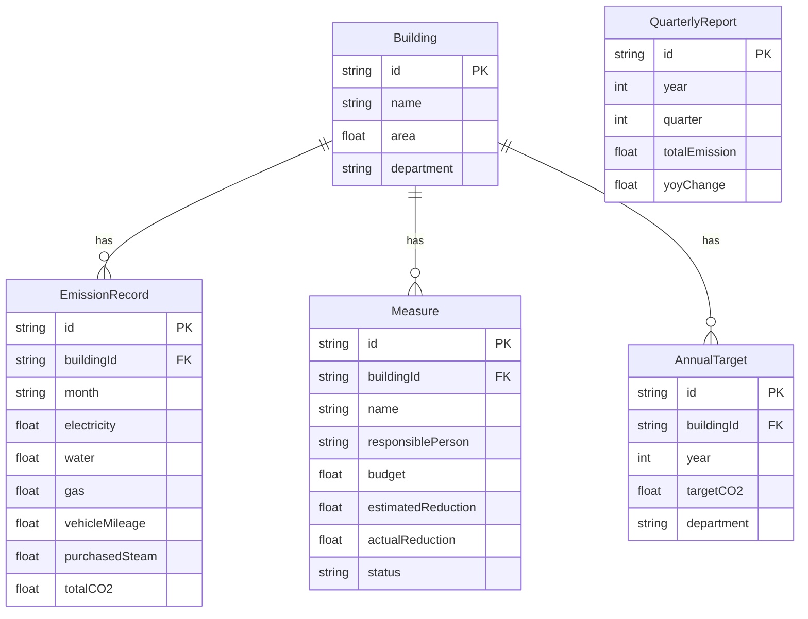

## 1. 架构设计



前端采用纯 React SPA 架构，无需后端服务。数据通过 Mock 服务管理，使用 LocalStorage 实现数据持久化。

## 2. 技术说明

- **前端框架**：React@18 + TypeScript
- **样式方案**：Tailwind CSS@3
- **构建工具**：Vite
- **路由**：React Router@6
- **图表库**：Recharts（轻量、React 原生支持）
- **状态管理**：Zustand（轻量状态管理）
- **图标**：Lucide React
- **数据持久化**：LocalStorage（无需后端）
- **导出功能**：html2canvas + jspdf（PDF 导出）、xlsx（Excel 导出）

## 3. 路由定义

| 路由 | 用途 |
|------|------|
| `/` | 总览页，展示月度排放趋势、能耗结构、目标差距 |
| `/emission` | 排放录入页，五类排放数据登记与历史查询 |
| `/measures` | 措施库页，节能项目管理与状态追踪 |
| `/targets` | 目标看板页，多维度目标进度对比 |
| `/reports` | 报告页，季度摘要与导出功能 |

## 4. API 定义

无后端 API，使用前端 Mock 数据服务。数据结构定义如下：

```typescript
interface Building {
  id: string;
  name: string;
  area: number;
  department: string;
}

interface EmissionRecord {
  id: string;
  buildingId: string;
  month: string;
  electricity: number;
  water: number;
  gas: number;
  vehicleMileage: number;
  purchasedSteam: number;
  electricityCO2: number;
  waterCO2: number;
  gasCO2: number;
  vehicleCO2: number;
  steamCO2: number;
  totalCO2: number;
}

interface Measure {
  id: string;
  name: string;
  buildingId: string;
  responsiblePerson: string;
  budget: number;
  estimatedReduction: number;
  actualReduction: number;
  startDate: string;
  endDate: string;
  status: "planning" | "executing" | "completed" | "paused";
  description: string;
}

interface AnnualTarget {
  id: string;
  buildingId: string;
  year: number;
  targetCO2: number;
  department: string;
}

interface QuarterlyReport {
  id: string;
  year: number;
  quarter: number;
  totalEmission: number;
  yoyChange: number;
  measureProgress: string;
  anomalies: AnomalyItem[];
  todos: TodoItem[];
}

interface AnomalyItem {
  month: string;
  buildingName: string;
  description: string;
  severity: "low" | "medium" | "high";
}

interface TodoItem {
  id: string;
  title: string;
  type: "overdue_measure" | "expiring_project" | "missing_data";
  dueDate: string;
  status: "pending" | "done";
}
```

## 5. 服务器架构图

不适用（纯前端项目，无后端服务）

## 6. 数据模型

### 6.1 数据模型定义



### 6.2 排放因子

| 能源类型 | 单位 | 排放因子 (kgCO₂/单位) |
|----------|------|----------------------|
| 电力 | kWh | 0.5810 |
| 水 | 吨 | 0.1480 |
| 燃气 | m³ | 2.1622 |
| 车辆里程 | km | 0.2100 |
| 外购蒸汽 | GJ | 0.1100 |
